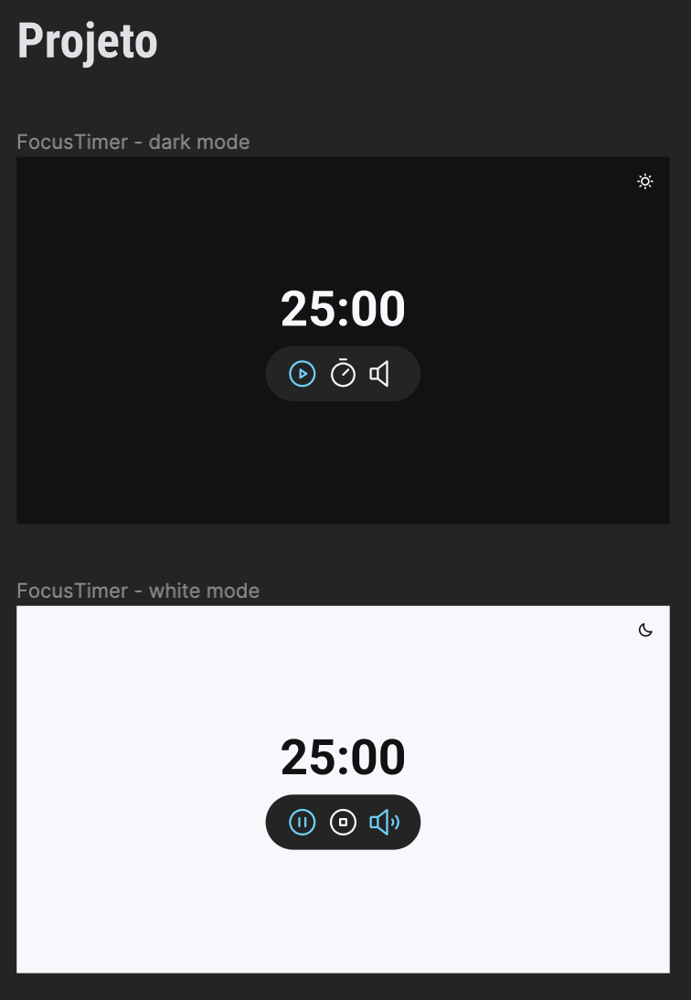
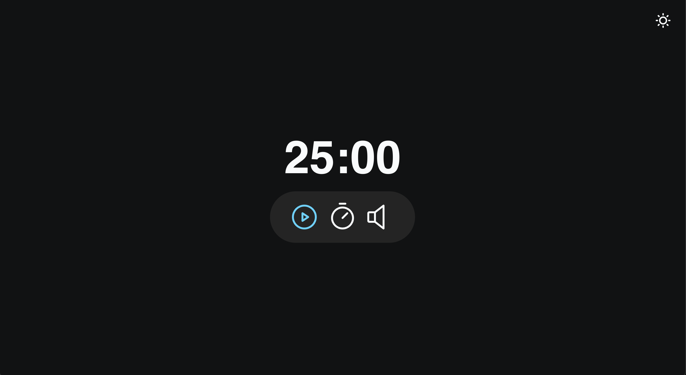
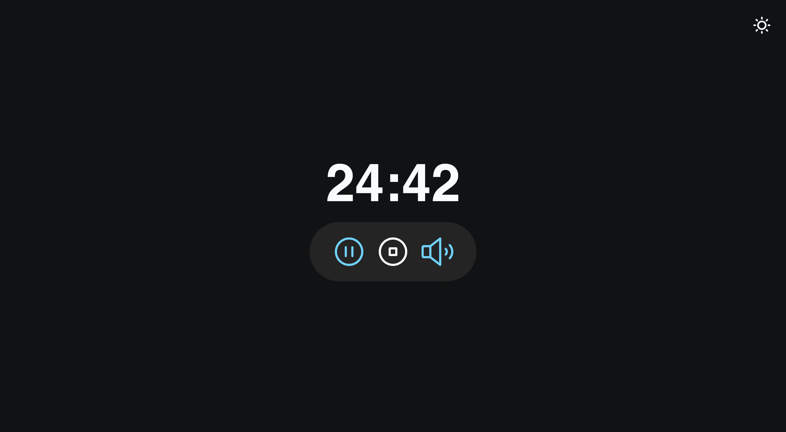
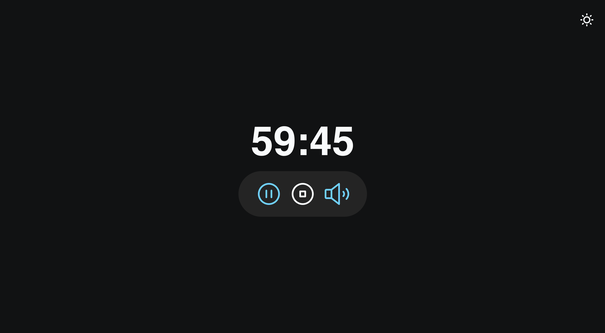
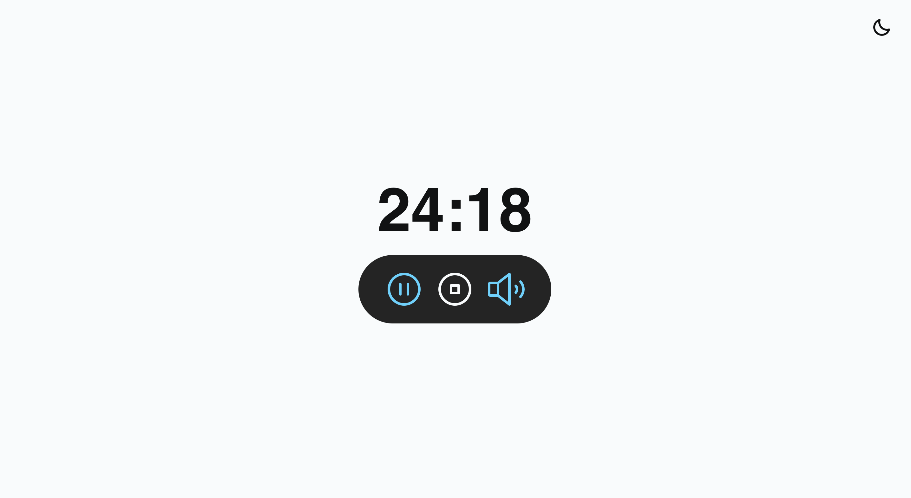
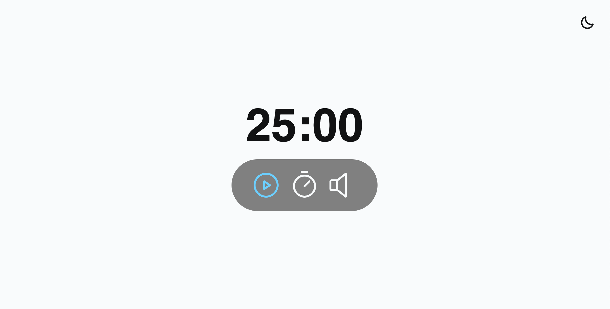
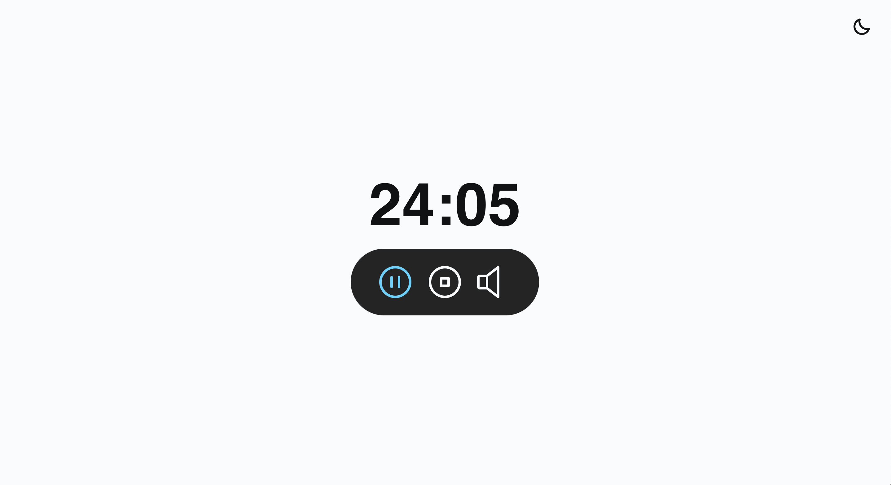

# ⏰ FocusTimer / Pomodoro / Temporizador de foco.
⏰ *FocusTimer* 

🇧🇷 O projeto FocusTimer, têm o objetivo de ajudar as pessoas a manter o foco no trabalho ou nos estudos, utilizando a Técnica pomodoro, que é um método de gerenciamento de tempo desenvolvido por Francesco Cirillo no final dos anos 1980. A técnica consiste na utilização de um cronômetro para dividir o trabalho em períodos de 25 minutos, separados por breves intervalos. 
A técnica deriva seu nome da palavra italiana pomodoro (tomate), como referência ao popular cronômetro gastronômico na forma dessa fruta. O método é baseado na ideia de que pausas frequentes podem aumentar a agilidade mental.
O objetivo foi criar o FocusTimer 2.0 revendo alguns dos conceitos de Javascript. 
# 
🇺🇸 *The FocusTimer project, aims to help people stay focused on work or studies, using the Pomodoro Technique, which is a time management method developed by Francesco Cirillo in the late 1980s. The technique consists of using a timer to divide work into 25-minute periods, separated by short breaks.
The technique derives its name from the Italian word pomodoro (tomato), as a reference to the popular gastronomic timer in the shape of this fruit. The method is based on the idea that frequent breaks can increase mental agility.
The objective was to create FocusTimer 2.0 by reviewing some of the Javascript concepts.*
#
📸 Screenshot Project Figma:

# 🚀 Technologies

🇧🇷 Esse projeto foi desenvolvido com as seguintes tecnologias:
 
🇺🇸 This project was developed with the following technologies:

- [HTML](./html/index.html)
- [CSS](./css/index.)
- [Git e Github](https://biancamos.github.io)
- [Figma](https://www.figma.com/file/AusB6SGmqEGdvxf0HWPMen/Focus-Timer-V2-%E2%80%A2-Projeto-Explorer-(Community)?type=design&node-id=0-1&mode=design&t=GC9c7j3E4jdUki1H-0)

# 📸 Screenshot Project:

#

- **[🔗 Online project](https://biancamos.github.io)**
#

🗓️ (Rocketseat Setembro-2023 / September-2023)
#
                  Feito com 😅 by BM